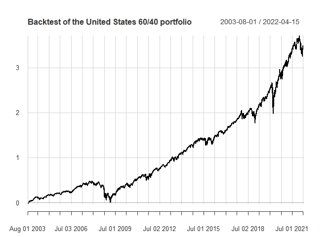
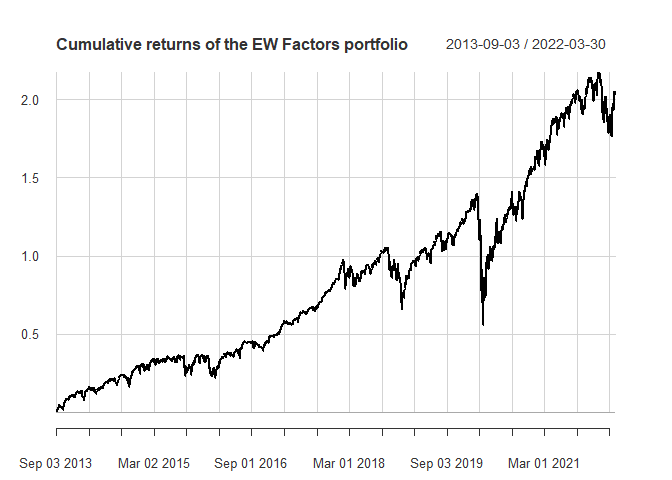

<!-- README.md is generated from README.Rmd. Please edit that file -->

# AssetAllocation

<!-- badges: start -->

<!-- badges: end -->

The goal of AssetAllocation is to perform backtesting of customizable asset allocation strategies. The main function that the user interacts with is backtest_allocation().

## Installation

You can install the development version of AssetAllocation from [GitHub](https://github.com/) with:

``` r
# install.packages("devtools")
devtools::install_github("rubetron/AssetAllocation")
```

## Example

Simple example using pre-loaded strategy (see the vignette for other examples):

``` r
library(AssetAllocation)
#> Registered S3 method overwritten by 'quantmod':
#>   method            from
#>   as.zoo.data.frame zoo
## Example 1: backtesting one of the asset allocations in the package
us_60_40 <- asset_allocations$static$us_60_40

# test using the data set provided in the package
bt_us_60_40 <- backtest_allocation(us_60_40,
                                   ETFs$Prices,
                                   ETFs$Returns,
                                   ETFs$risk_free)

# plot returns
library(PerformanceAnalytics)
#> Loading required package: xts
#> Loading required package: zoo
#> 
#> Attaching package: 'zoo'
#> The following objects are masked from 'package:base':
#> 
#>     as.Date, as.Date.numeric
#> 
#> Attaching package: 'PerformanceAnalytics'
#> The following object is masked from 'package:graphics':
#> 
#>     legend
chart.CumReturns(bt_us_60_40$returns,
                 main = paste0("Backtest of the ",
                               bt_us_60_40$strat$name,
                               " portfolio"),
                 ylab = "Cumulative returns"
)
```



``` r
# show table with performance metrics
bt_us_60_40$table_performance
#>                               United.States.60.40
#> Annualized Return                          0.0803
#> Annualized Std Dev                         0.1013
#> Annualized Sharpe (Rf=1.18%)               0.6669
#> daily downside risk                        0.0045
#> Annualised downside risk                   0.0718
#> Downside potential                         0.0019
#> Omega                                      1.1466
#> Sortino ratio                              0.0618
#> Upside potential                           0.0022
#> Upside potential ratio                     0.6175
#> Omega-sharpe ratio                         0.1466
#> Semi Deviation                             0.0046
#> Gain Deviation                             0.0046
#> Loss Deviation                             0.0053
#> Downside Deviation (MAR=210%)              0.0100
#> Downside Deviation (Rf=1.18%)              0.0045
#> Downside Deviation (0%)                    0.0045
#> Maximum Drawdown                           0.3260
#> Historical VaR (95%)                      -0.0093
#> Historical ES (95%)                       -0.0155
#> Modified VaR (95%)                        -0.0086
#> Modified ES (95%)                         -0.0086
```

Another example creating a strategy from scratch, retrieving data from Yahoo Finance, and backtesting:

``` r
library(AssetAllocation)
# create a strategy that invests equally in momentum (MTUM), value (VLUE), low volatility (USMV) and quality (QUAL) ETFs.

factors_EW  <- list(name = "EW Factors",
                      tickers = c("MTUM", "VLUE", "USMV", "QUAL"),
                      default_weights = c(0.25, 0.25, 0.25, 0.25),
                      rebalance_frequency = "month",
                      portfolio_rule_fn = "constant_weights")

# get data for tickers using getSymbols
factor_ETFs_data <- get_data_from_tickers(factors_EW$tickers,
                                      starting_date = "2013-08-01")
#> 'getSymbols' currently uses auto.assign=TRUE by default, but will
#> use auto.assign=FALSE in 0.5-0. You will still be able to use
#> 'loadSymbols' to automatically load data. getOption("getSymbols.env")
#> and getOption("getSymbols.auto.assign") will still be checked for
#> alternate defaults.
#> 
#> This message is shown once per session and may be disabled by setting 
#> options("getSymbols.warning4.0"=FALSE). See ?getSymbols for details.
# backtest the strategy
bt_factors_EW <- backtest_allocation(factors_EW,factor_ETFs_data$P, factor_ETFs_data$R)

# plot returns
charts.PerformanceSummary(bt_factors_EW$returns,
                          main = bt_factors_EW$strat$name,
                               )
```



``` r
# table with performance metrics
bt_factors_EW$table_performance
#>                               EW.Factors
#> Annualized Return                 0.1233
#> Annualized Std Dev                0.1731
#> Annualized Sharpe (Rf=0%)         0.7125
#> daily downside risk               0.0078
#> Annualised downside risk          0.1246
#> Downside potential                0.0032
#> Omega                             1.1652
#> Sortino ratio                     0.0664
#> Upside potential                  0.0037
#> Upside potential ratio            0.5665
#> Omega-sharpe ratio                0.1652
#> Semi Deviation                    0.0081
#> Gain Deviation                    0.0077
#> Loss Deviation                    0.0094
#> Downside Deviation (MAR=210%)     0.0125
#> Downside Deviation (Rf=0%)        0.0078
#> Downside Deviation (0%)           0.0078
#> Maximum Drawdown                  0.3499
#> Historical VaR (95%)             -0.0161
#> Historical ES (95%)              -0.0266
#> Modified VaR (95%)               -0.0151
#> Modified ES (95%)                -0.0168
```
