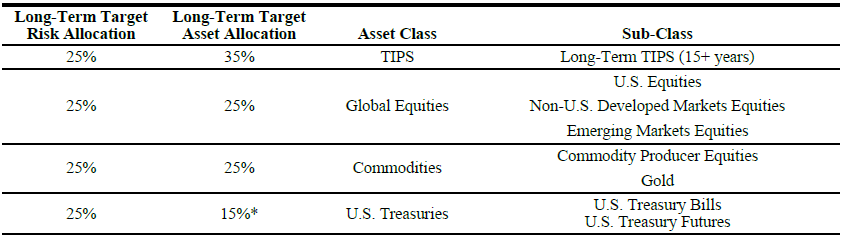

```{r include=FALSE}
knitr::opts_chunk$set(
  collapse = TRUE,
  comment = "#>",
  fig.width=7, fig.height=5
)
```

This vignette illustrates some ways to use the `AssetAllocation` package to backtest different asset allocation strategies.

# Rationale for the package

There are several alternatives to backtest systematic/quantitative investment strategies in R. The aim of this package is to provide a simplified way to backtest simple asset allocation rules. That is, with a few lines of code, the user can create and backtest simple static or dynamic (tactical) asset allocation strategies.

The package comes with a set of pre-loaded static and tactical strategies, which are in the `asset_allocations` object. However, the user can easily create their own strategies, either by choosing specific allocations in a static asset allocation, or by creating their own custom function that implements a dynamic strategy.

# Basic definitions

Within the context of the package, an asset allocation strategy is an object of the type `list` which contains the following elements:

1.  `name`: an object of type `character` with the name of the strategy

2.  `tickers`: a vector of type `character` containing the tickers of the assets to be used. These must either correspond to the column names in the user-provided data to be used to backtest the strategy, or to tickers in Yahoo Finance.

3.  `default_weights`: a vector of type `numeric` containing the default weights to invest in each asset in decimals. The sum of the weights should be less than or equal to one. Any amount not invested in the assets is automatically assumed to be invested in the risk-free rate. If the rebalance function is `risk_parity`, this field should contain the risk budgets (in decimals, the sum should equal one).

4.  `rebalance_frequency`: an object of type `character` which determines the rebalancing frequency. Options are "days", "weeks", "months", "quarters", and "years".

5.  `portfolio_rule_fn`: an object of type `character` containing the name of the rebalancing function that determines allocations for the next period. A valid rebalancing function takes as inputs a strategy, a rebalancing date, an `xts` matrix of prices, an `xts` matrix of returns, and an `xts` vector of returns on a risk-free asset. The function returns a vector of type `numeric` with the same number of elements as the object `strat$tickers`. Some specific cases that come with the package are:

    -   static asset allocation strategies: `"constant_weights"`

    -   Ivy Portfolio: `"tactical_ivy"`

    -   Dual Momentum: `"tactical_DualMomentum"`

    -   Robust Asset Allocation: `"tactical_RAA"`

    -   Adaptive Asset Allocation: `"tactical_AAA"`

    -   Minimum variance: `"min_variance"`

    -   Risk parity: `"risk_parity"`

A few comments:

-   The rebalancing function for tactical asset allocation strategies may contain specific choices regarding calculation of covariance matrices, look-back periods and so on. Consult the help for each rebalancing function for details.

-   Some rebalancing function require additional elements. For example, the "Dual Momentum" strategy requires the asset classes of each ticker. I've tried to make the package generic enough to allow users to backtest allocation rules with other assets, while at the same time maintaining a (hopefully) simple syntax.

# Basic workflow

To use the package, the user follows basically two steps:

1.  Create a strategy with the elements described above (or choose one of the pre-loaded strategies)

2.  Backtest the strategy by creating a new object using the function `backtest_allocation` and some data. The `backtest_allocation` function expects a strategy with the elements described above, as well as an `xts` matrix of prices, an `xts` matrix of returns, and an optional `xts` vector of returns on a risk-free asset. The user can also provide an optional starting date. Importantly, the tickers in the strategy should correspond to valid columns of the price and return objects.

# Pre-loaded strategies

As defined above, an asset allocation strategy is a portfolio comprised of a set of assets, with portfolios weights determined by a specific rule, rebalanced at some frequency. The package comes with several pre-loaded asset allocation strategies, which generally come from published sources. These are in the object `asset_allocations`.

# Data

All of the pre-loaded asset allocation strategies are defined in terms of exchange-traded funds, data for which are available in the `ETFs` data set. Users can type `?ETFs` to obtain more information. The purpose of the pre-loaded strategies and data is to demonstrate how to use the package. Users can test their own strategies using their own data, or they can also specify their own assets and have the package retrieve data automatically from Yahoo Finance.

# Testing asset allocations

We load the package and inspect the available pre-loaded static (i.e., constant-weight) asset allocations:

```{r setup}
library(AssetAllocation)
library(PerformanceAnalytics)
names(asset_allocations$static)
```

## Example 1: Ray Dalio's All Weather Portfolio

One of the pre-loaded static asset allocations is Ray Dalio's All Weather Portfolio. The strategy invests 30% in U.S. stocks (represented by the SPY ETF), 40% in long-term U.S. Treasuries (TLT), 15% in intermediate-term U.S. Treasuries (IEF), 7.5% in gold (GLD), and 7.5% in commodities (DBC).

```{r all weather 1}
asset_allocations$static$all_weather
```

To backtest this strategy with the data in the `ETFs` object, we simply do:

```{r all weather 2}
# define strategy 
all_weather <- asset_allocations$static$all_weather

# backtest strategy
bt_all_weather <- backtest_allocation(all_weather, ETFs$Prices, ETFs$Returns, ETFs$risk_free)
```

The output from `backtest_allocation` contains the daily returns of the strategy in the `$returns` object. A convenient way to visualize the results is by using the `charts.PerformanceSummary` function from the `PerformanceAnalytics` package:

```{r all weather 3}
# plot cumulative returns
charts.PerformanceSummary(bt_all_weather$returns, 
                          main = all_weather$strat$name)
```

A basic set of performance statistics is provided in `$table_performance`:

```{r all weather 4}
# table with performance metrics
bt_all_weather$table_performance
```

The allocations over time are stored in `$weights`. Of course, for static, buy-and-hold asset allocations, the portfolio weights always remains the same:

```{r all weather 5}
chart.StackedBar(bt_all_weather$rebalance_weights,
                 date.format = "%Y",
                 main = paste0("Allocations, ", all_weather$name))
```

As should be clear from the graph above, the weights that are stored in `$weights` are the weights on the rebalancing dates. Even for a static, buy-and-hold strategy, the actual weights between rebalancing dates will fluctuate.

The other pre-loaded static asset allocations may be tested analogously.

## Example 2: Creating and testing a custom static asset allocation

In this example, we create a custom strategy from scratch. The strategy invests equally in momentum (MTUM), value (VLUE), low volatility (USMV) and quality (QUAL) ETFs. We first set up this custom strategy as follows:

```{r factors EW setup}
factors_EW  <- list(name = "EW Factors",
                      tickers = c("MTUM", "VLUE", "USMV", "QUAL"),
                      default_weights = c(0.25, 0.25, 0.25, 0.25),
                      rebalance_frequency = "month",
                      portfolio_rule_fn = "constant_weights")
```

Next, we can automatically download data from Yahoo Finance using the `get_data_from_tickers` function:

```{r factors EW data, message=FALSE, warning=FALSE}
factor_ETFs_data <- get_data_from_tickers(factors_EW$tickers,
                                      starting_date = "2013-08-01")

```

Finally, we backtest the strategy and show the results:

```{r factors EW bt}
# backtest the strategy
bt_factors_EW <- backtest_allocation(factors_EW,factor_ETFs_data$P, factor_ETFs_data$R)

# plot returns
charts.PerformanceSummary(bt_factors_EW$returns,
                          main = bt_factors_EW$strat$name,
                               )

# table with performance metrics
bt_factors_EW$table_performance
```

## Example 3: Testing tactical asset allocation strategies

In this example, we test and compare four pre-loaded tactical asset allocation strategies: the Ivy Portfolio, the Robust Asset Allocation strategy, the Dual Momentum strategy, and the Adaptive Asset Allocation strategy. A brief description of each strategy (as well as appropriate references) is provided in the corresponding rebalancing functions.

```{r tactical setup}
# define strategies
ivy <- asset_allocations$tactical$ivy
raa <- asset_allocations$tactical$raa
dual_mo <- asset_allocations$tactical$dual_mo
aaa <- asset_allocations$tactical$aaa

# run backtests
bt_ivy <- backtest_allocation(ivy, ETFs$Prices,ETFs$Returns, ETFs$risk_free)
bt_raa <- backtest_allocation(raa, ETFs$Prices,ETFs$Returns, ETFs$risk_free)
bt_dual_mo <- backtest_allocation(dual_mo, ETFs$Prices,ETFs$Returns, ETFs$risk_free)
bt_aaa <- backtest_allocation(aaa, ETFs$Prices,ETFs$Returns, ETFs$risk_free)

ret_strats <- merge.xts(bt_ivy$returns, bt_raa$returns, bt_dual_mo$returns, bt_aaa$returns)

# find index from which all strats are available
min_ind <- which.max(!is.na(rowSums(ret_strats)))

charts.PerformanceSummary(ret_strats[min_ind:nrow(ret_strats)])

cbind(bt_ivy$table_performance,
      bt_raa$table_performance,
      bt_dual_mo$table_performance,
      bt_aaa$table_performance)

```

Visualizing allocations for all strategies:

```{r tactical allocations}
chart.StackedBar(bt_ivy$rebalance_weights,
                 date.format = "%Y",
                 main = paste0("Allocations, ", bt_ivy$strat$name))

chart.StackedBar(bt_raa$rebalance_weights,
                 date.format = "%Y",
                 main = paste0("Allocations, ", bt_raa$strat$name))

chart.StackedBar(bt_dual_mo$rebalance_weights,
                 date.format = "%Y",
                 main = paste0("Allocations, ", bt_dual_mo$strat$name))

chart.StackedBar(bt_aaa$rebalance_weights,
                 date.format = "%Y",
                 main = paste0("Allocations, ", bt_aaa$strat$name))

```

## Example 4: Minimum variance portfolio

In this example, we create a strategy that uses the minimum variance portfolio rule using U.S. stocks and bonds. At each rebalancing date, this strategy uses optimization to determine the weights that yield the minimum variance possible.

```{r mvp, message=FALSE, warning=FALSE}
# Minimum variance portfolio
us_mvp  <- list(name = "US MinVar",
               tickers = c("VTI",
                           "BND"),
               default_weights = c(0.5,
                                   0.5),
               rebalance_frequency = "month",
               portfolio_rule_fn = min_variance)

bt_us_mvp <- backtest_allocation(us_mvp,
                                ETFs$Prices,
                                ETFs$Returns,
                                ETFs$risk_free)

charts.PerformanceSummary(bt_us_mvp$returns)

bt_us_mvp$table_performance
```

As expected, this strategy would invest heavily in bonds:

```{r mvp plot}
chart.StackedBar(bt_us_mvp$rebalance_weights,
                 date.format = "%Y",
                 main = paste0("Allocations, ", us_mvp$name))
```

## Example 5: Risk Parity

Finally, in this example, we test a risk parity portfolio inspired on the [RPAR ETF](https://www.rparetf.com/rpar). As described in the prospectus, this ETF targets the following risk allocations:



Risk parity is implemented in the `risk_parity` rebalancing function, which considers as risk budgets the values in the default_weights element of the strategy.[^1] Our "clone" RPAR strategy uses the following ETFs:

[^1]: The `risk_parity` function itself uses functions from the `riskParityPortfolio` package.

-   TIPS: TIP

-   Global Equities

    -   US equities: VTI

    -   Non-U.S. Developed Markets Equities: EFA

    -   Emerging Markets Equities: EEM

-   Commodities

    -   Commodities: DBC

    -   Gold: GLD

-   U.S. Treasuries: IEF

The risk budgets are set to 25% for each of the four categories above, and equally per asset within each category:

```{r risk parity setup}
rp  <- list(name = "US Risk Parity",
             tickers = c("TIP",
                         "VTI", "EFA", "EEM",
                         "DBC", "GLD",
                         "IEF"),
             default_weights = c(0.25,
                                 0.25/3, 0.25/3, 0.25/3,
                                 0.25/2, 0.25/2,
                                 0.25),
             rebalance_frequency = "month",
             portfolio_rule_fn = "risk_parity")
             
bt_rp <- backtest_allocation(rp,
                                 ETFs$Prices,
                                 ETFs$Returns,
                                 ETFs$risk_free)
```

As expected, the volatility is quite low, since 50% of the risk budget is allocated to fixed income:

```{r risk parity perf}
charts.PerformanceSummary(bt_rp$returns)
bt_rp$table_performance
```

We can check the correlation with the actual RPAR ETF:

```{r risk parity compare, message=FALSE, warning=FALSE}
rpar <- get_data_from_tickers("RPAR")
rp_compare <- merge.xts(bt_rp$returns, rpar$R, join = "right")
rp_compare <- na.omit(rp_compare)
cor(rp_compare)
```

Despite the high correlation, RPAR has about twice the volatility of our strategy. The reason is that the ETF can rely on leverage through futures:

```{r risk parity stats}
table.AnnualizedReturns(rp_compare)
```

We can rescale the clone to have the same ex-post volatility for an apples-to-apples comparison:

```{r risk parity rescale}
rp_rescale_factor <- table.AnnualizedReturns(rp_compare)[2,2]/table.AnnualizedReturns(rp_compare)[2,1]

rp_compare[, 1] <- rp_compare[, 1] * rp_rescale_factor

charts.PerformanceSummary(rp_compare)
```

# Final thoughts - creating your own strategies

Creating your own static asset allocation strategies is straightforward. Just add the tickers and set `portfolio_rule_fn = "constant_weights"`. To create your own dynamic/tactical rebalancing functions, you can look at the provided functions to get some ideas. One important thing to keep in mind is to ensure that the rebalancing function only uses data until each rebalancing date, in order to avoid look-ahead bias. Take a look at the tactical rebalancing functions in the package to see one way to achieve this.
